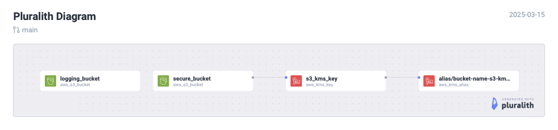

<!-- BEGIN_TF_DOCS -->
 # terraform-aws-s3
 This Terraform module is used to instantiate an AWS S3 Bucket based on [AWS Security Best Practices](https://docs.aws.amazon.com/AmazonS3/latest/userguide/security-best-practices.html):
 - Enforce encryption of data at rest using AWS Key Management Service (KMS)
 - Enforce encryption of data in transit
 - Consider using S3 Object Lock
 - Implement least privilege access by blocking public access by default
 - Enforce S3 Versioning
 - Enable Amazon S3 server access logging
 ## Usage
 To instantiate an AWS S3 bucket based on the AWS Security Best Practices, you need to provide a unique bucket name.  Bucket names must be unique across all AWS accounts in all the AWS Regions within a partition. A partition is a grouping of Regions. Since server access logging is enabled by default, you must either specify the name of an existing S3 bucket where the logs will be stored, or specify to have a new bucket created by setting `create_logging_bucket` to `true`.  If the S3 bucket is intended to be used for static website hosting, the following will happen:
 - Encryption of data at rest will use an Amazon S3 Managed Key (SSE-S3)
 - Encryption of data in transit will not be enforced
 - Public access will be enabled
 - A bucket policy will be created to allow anyone to perform `GetObject` on any S3 objects
 ## Diagram
 

## Inputs

| Name | Description | Type | Default | Required |
|------|-------------|------|---------|:--------:|
| <a name="input_block_public_access"></a> [block\_public\_access](#input\_block\_public\_access) | Enable or disable blocking public access to the bucket. | `bool` | `true` | no |
| <a name="input_bucket_name"></a> [bucket\_name](#input\_bucket\_name) | The name of the S3 bucket. | `string` | n/a | yes |
| <a name="input_create_logging_bucket"></a> [create\_logging\_bucket](#input\_create\_logging\_bucket) | Whether to create logging bucket. | `bool` | `true` | no |
| <a name="input_logging_bucket_name"></a> [logging\_bucket\_name](#input\_logging\_bucket\_name) | The name of the logging bucket where access logs will be stored. | `string` | n/a | yes |
| <a name="input_object_lock_enabled"></a> [object\_lock\_enabled](#input\_object\_lock\_enabled) | Enable or disable object lock for data protection. | `bool` | `false` | no |
| <a name="input_object_lock_retention"></a> [object\_lock\_retention](#input\_object\_lock\_retention) | Number of days to retain objects when object lock is enabled. | `number` | `30` | no |
| <a name="input_static_website_hosting"></a> [static\_website\_hosting](#input\_static\_website\_hosting) | Enable or disable static website hosting. | `bool` | `false` | no |

## Outputs

| Name | Description |
|------|-------------|
| <a name="output_id"></a> [id](#output\_id) | The name of the created S3 bucket. |
| <a name="output_region"></a> [region](#output\_region) | The region of the created S3 bucket. |  

## Example
### Secured S3 Bucket
```hcl
module "secured-bucket" {
    source                  = "../../"

    bucket_name             = var.bucket_name
    static_website_hosting  = false
    block_public_access     = true
    create_logging_bucket   = true
    logging_bucket_name     = "cloudful-logs"
}
```

### S3 Bucket for Static Website
```hcl
module "static_website" {
    source                  = "../../"

    bucket_name             = var.bucket_name
    static_website_hosting  = true
    block_public_access     = false
    create_logging_bucket   = true
    logging_bucket_name     = "cloudful-logs"
}
```

## Providers

| Name | Version |
|------|---------|
| <a name="provider_aws"></a> [aws](#provider\_aws) | 4.64.0 |

## Requirements

| Name | Version |
|------|---------|
| <a name="requirement_terraform"></a> [terraform](#requirement\_terraform) | >= 1.3.0 |
| <a name="requirement_aws"></a> [aws](#requirement\_aws) | 4.64.0 |

## Resources

| Name | Type |
|------|------|
| [aws_kms_alias.s3_kms_alias](https://registry.terraform.io/providers/hashicorp/aws/4.64.0/docs/resources/kms_alias) | resource |
| [aws_kms_key.s3_kms_key](https://registry.terraform.io/providers/hashicorp/aws/4.64.0/docs/resources/kms_key) | resource |
| [aws_s3_bucket.logging_bucket](https://registry.terraform.io/providers/hashicorp/aws/4.64.0/docs/resources/s3_bucket) | resource |
| [aws_s3_bucket.secure_bucket](https://registry.terraform.io/providers/hashicorp/aws/4.64.0/docs/resources/s3_bucket) | resource |
| [aws_s3_bucket_logging.logging](https://registry.terraform.io/providers/hashicorp/aws/4.64.0/docs/resources/s3_bucket_logging) | resource |
| [aws_s3_bucket_object_lock_configuration.object_lock](https://registry.terraform.io/providers/hashicorp/aws/4.64.0/docs/resources/s3_bucket_object_lock_configuration) | resource |
| [aws_s3_bucket_policy.allow_access_from_everyone](https://registry.terraform.io/providers/hashicorp/aws/4.64.0/docs/resources/s3_bucket_policy) | resource |
| [aws_s3_bucket_policy.https_policy](https://registry.terraform.io/providers/hashicorp/aws/4.64.0/docs/resources/s3_bucket_policy) | resource |
| [aws_s3_bucket_policy.logging_bucket_policy](https://registry.terraform.io/providers/hashicorp/aws/4.64.0/docs/resources/s3_bucket_policy) | resource |
| [aws_s3_bucket_public_access_block.block_public](https://registry.terraform.io/providers/hashicorp/aws/4.64.0/docs/resources/s3_bucket_public_access_block) | resource |
| [aws_s3_bucket_server_side_encryption_configuration.sse_kms_encryption](https://registry.terraform.io/providers/hashicorp/aws/4.64.0/docs/resources/s3_bucket_server_side_encryption_configuration) | resource |
| [aws_s3_bucket_versioning.versioning](https://registry.terraform.io/providers/hashicorp/aws/4.64.0/docs/resources/s3_bucket_versioning) | resource |
| [aws_s3_bucket_website_configuration.s3_website_configuration](https://registry.terraform.io/providers/hashicorp/aws/4.64.0/docs/resources/s3_bucket_website_configuration) | resource |

## References
- [AWS Security Best Practices](https://docs.aws.amazon.com/AmazonS3/latest/userguide/security-best-practices.html)
<!-- END_TF_DOCS -->